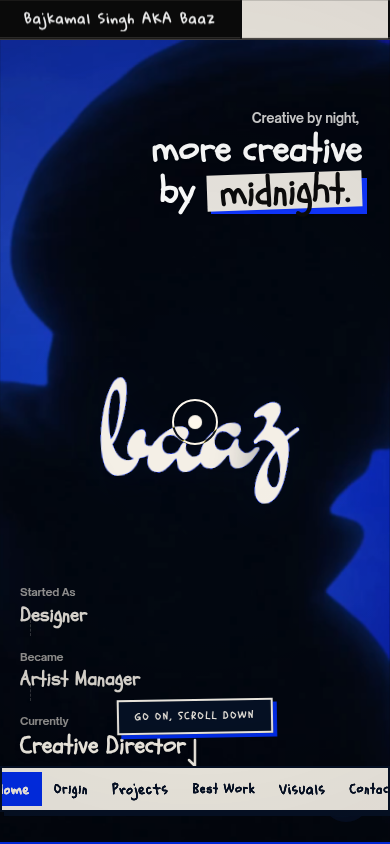

# Baaz — original site mirror

This replaces the earlier approximation with the actual HTML, CSS, and interaction JavaScript served by [bajkamalsingh.me](https://bajkamalsingh.me/), at the site owner's request. It preserves the original intro, hero parallax and extruded text, magnetic cursor and ten-part spring trail, diary focus lens and book choreography, draggable stickers, cinematic navigation, expanding project dossiers, complete Delhi Metro journey and case studies, gallery artwork trail, and Tone.js sound design.

`reference/site.html` is the captured source. `index.html` is generated from it. The original application markup, styles, and scripts are kept intact; this is now a source mirror rather than an independently approximated design.

## Run

Use Node.js 24 and Python 3. The cloud environment has both.

```sh
npm ci --cache /tmp/baaz-npm-cache
npm run dev -- --port 5173
```

The development server serves the original page without adding a framework, hot-reload scripts, or changing its styles. It supports HTTP byte ranges for the video.

```sh
npm run build
npm run preview
```

The production output in `dist/` contains the same page and local files. The preview server uses port 4173. There is no bundling or minification that could change the original stylesheet's behavior.

## Verify the copy

```sh
npm run verify
npm run smoke
```

`verify` checks the complete application page against the captured original, allowing only the documented transport adaptations below. It also verifies SHA-256 checksums for all 170 downloaded scripts, stylesheets, fonts, and media resources. The original SHA-512 subresource-integrity attributes on GSAP, Lenis, and Tone.js are retained and were verified during download.

`smoke` runs an original-versus-local browser comparison. Both versions use the same captured upstream bytes, Chromium, viewport, media frame, virtual clock, and random seed. It exercises the actual interactions and records screenshots, image diffs, geometry, and results in the ignored `.artifacts/exact/` directory. The reference replay tests the captured upstream page; it does not claim that a later changed live page is identical.

The runner uses `/usr/bin/chromium` when available. Elsewhere, run `npx playwright install chromium` or set `CHROMIUM_PATH`. Use `TEST_BASE_URL` to target an already running server:

```sh
TEST_BASE_URL=http://127.0.0.1:4173 npm run smoke
```

## Documented transport adaptations

- The original 92 referenced media responses are served from `public/assets/`, preserving their bytes and filenames.
- Fonts and dependency scripts are served from `public/vendor/`. Remote font preconnects are removed because fonts are local.
- Cloudflare's per-request anti-bot iframe injection is removed. It belongs to the original host's infrastructure. The original email-decoding script is retained locally so mail links work.
- The live page references `lucide@0.435.0`, a version that does not exist in the npm registry and returns 404. Its application code already guards access to Lucide. The mirror omits that failing request and preserves the live site's absence of that icon library; it does not silently substitute a different version.

Two upstream media URLs, `hs1.jpg` and `hs2.jpg`, return the site HTML rather than image data. Their captured responses are preserved, so these two broken image slots also match the source site.

No original application effects are replaced with simplified versions. Browser rendering and the precise captured phase of an animation can still vary; screenshot difference measurements are reported rather than being described as universal pixel-perfect proof.

## Refresh resource downloads

```sh
npm run mirror
```

This regenerates the local page and downloads the resources referenced by the committed source snapshot. It preserves TLS verification and the original subresource-integrity checks. To adopt a later version of the live website, update `reference/site.html` deliberately first, then rerun the command and the comparisons.

The resource inventory, upstream URLs, checksums, and adaptations are in `reference/manifest.json`. Font licenses are retained in `public/assets/licenses/`; vendored scripts retain their original license headers. The owner retains the artwork and video rights.

The committed [validation report](docs/validation.md) records the checked states and measured differences.

## Preview captures


<details>
<summary>Mobile preview</summary>



</details>
