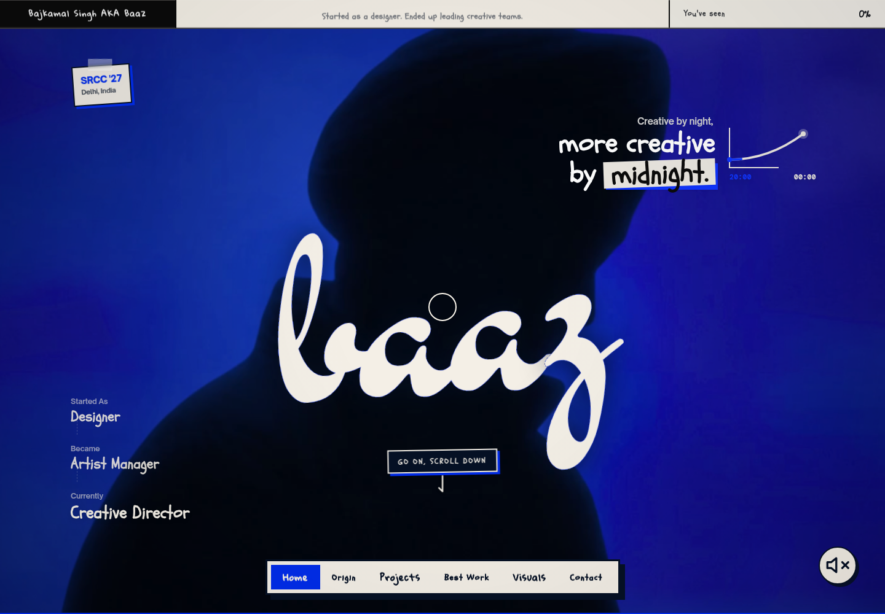
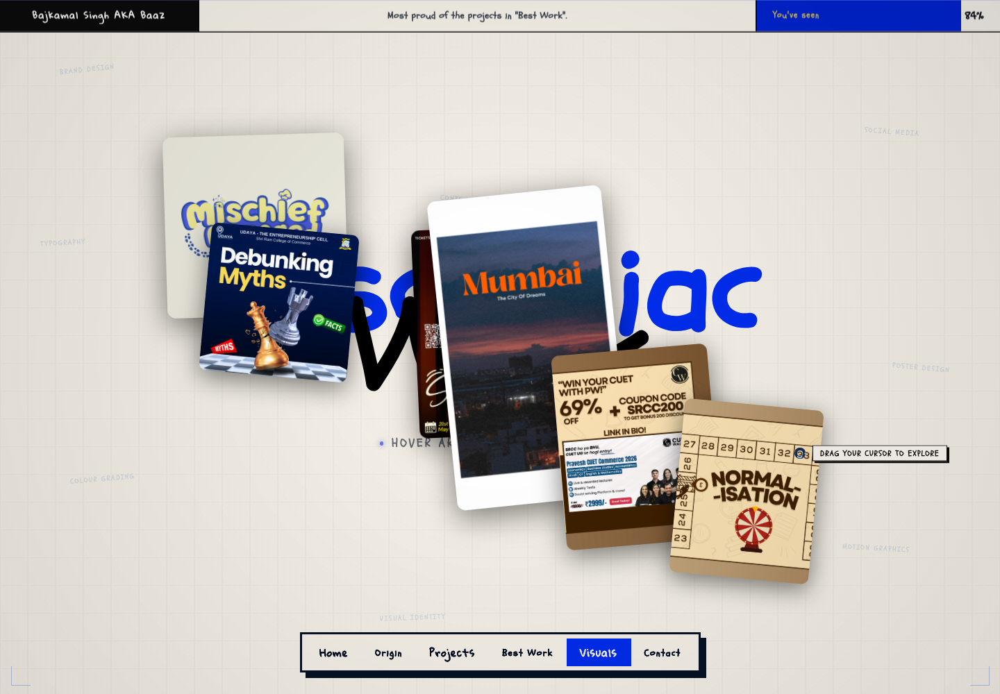
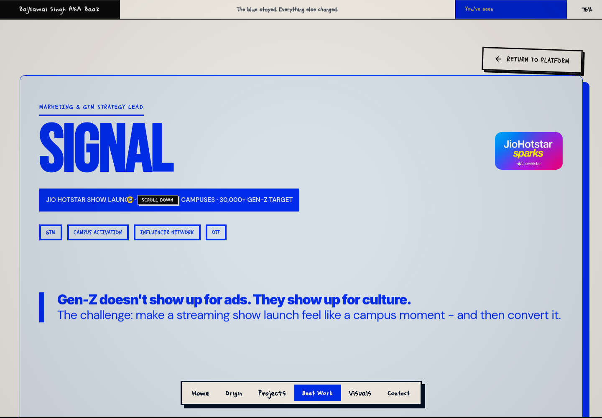
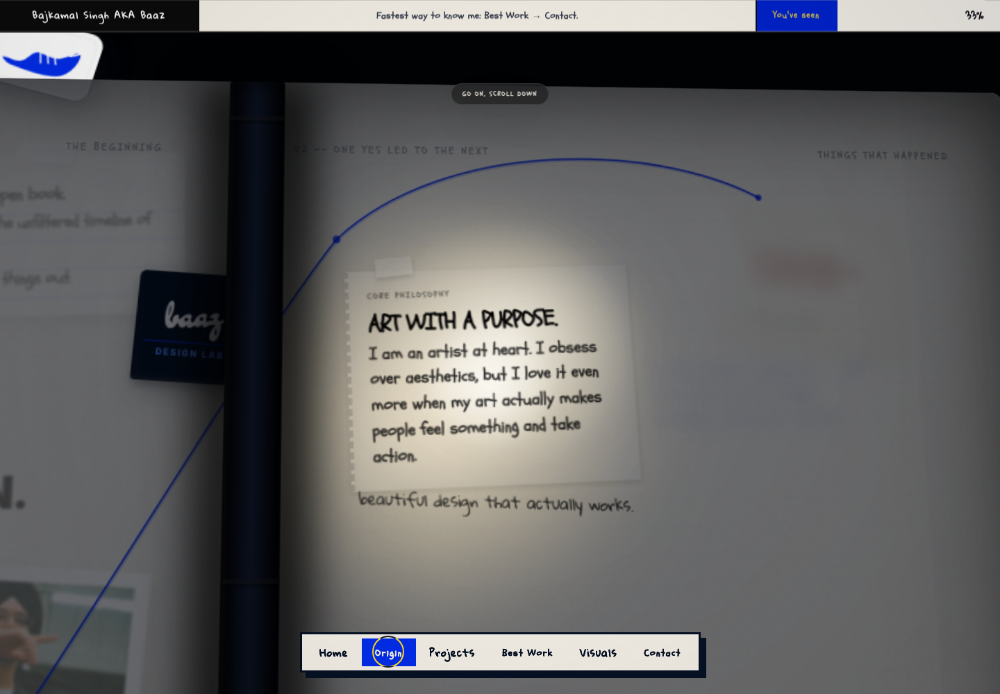

# Original-site mirror validation

Validated on 2026-10-02 with Node.js 24.19.0, Python 3.12.14, and Chromium. The local target was the production output served by `npm run preview`.

The entire generated application matches the captured original after the transport-only transformations documented in the README. All 170 vendored resource hashes and the two original font stylesheet hashes pass verification. `npm ci`, `npm run build`, and the production browser smoke test completed successfully.

The reference is a replay of the captured original source and resource bytes, with the original URLs. Both pages use the same viewport, seeded random generator, paused video frame, and virtual clock. This tests the captured source, rather than promising a later live version is identical.

## Functional checks

- desktop: original hero, fonts, playable video, ten-part cursor, navigation
- desktop: pointer-driven background parallax and 3D text
- desktop: magnetic hero cursor
- desktop: original diary/book scroll choreography
- desktop: all four original in-place expanding project cards
- desktop: original Metro doors and terminal
- desktop: five complete Metro case studies, next/previous controls, step-out and return transitions
- desktop: original gallery artwork trail
- desktop: original contact links and email decoding
- desktop: sound toggle enables and disables audio on a fresh hero
- desktop: no unexpected runtime errors or missing resources
- mobile: original hero, fonts, playable video, ten-part cursor, navigation
- mobile: pointer-driven background parallax and 3D text
- mobile: magnetic hero cursor
- mobile: original diary/book scroll choreography
- mobile: all four original in-place expanding project cards
- mobile: original Metro doors and terminal
- mobile: five complete Metro case studies, next/previous controls, step-out and return transitions
- mobile: original mobile gallery without the desktop-only mouse trail
- mobile: original contact links and email decoding
- mobile: sound toggle enables and disables audio on a fresh hero
- mobile: no unexpected runtime errors or missing resources

The audio toggle is checked on a freshly loaded hero independently of the navigation sequence. The mobile gallery deliberately omits the desktop-only artwork mouse trail, matching the original implementation.

## Screenshot measurements

Pixelmatch uses a 0.1 threshold. Differences are measured, not treated as zero merely because the source matches. The diary capture has the largest remaining difference even at matching scroll positions and timeline progress; its rendering difference is not fully isolated. Expanded-card captures also differ. No application styles or effects were changed to hide these measurements.

| State | Changed pixels (%) |
| --- | ---: |
| desktop-intro | 0.000000 |
| desktop-hero | 0.286389 |
| desktop-hero-parallax | 0.208611 |
| desktop-origin | 0.202917 |
| desktop-book-open | 5.840208 |
| desktop-projects | 0.197083 |
| desktop-project-expanded | 0.897917 |
| desktop-metro-gate | 0.216944 |
| desktop-metro-origin | 0.275625 |
| desktop-case-study-1 | 0.268819 |
| desktop-case-study-5 | 0.266250 |
| desktop-gallery | 0.273958 |
| desktop-gallery-trail | 0.282222 |
| desktop-contact | 0.290972 |
| mobile-intro | 0.000000 |
| mobile-hero | 0.000000 |
| mobile-hero-parallax | 0.002127 |
| mobile-origin | 0.000000 |
| mobile-book-open | 7.856058 |
| mobile-projects | 0.000000 |
| mobile-project-expanded | 1.760542 |
| mobile-metro-gate | 0.000000 |
| mobile-metro-origin | 0.000000 |
| mobile-case-study-1 | 0.000000 |
| mobile-case-study-5 | 0.000000 |
| mobile-gallery | 0.000000 |
| mobile-gallery-trail | 0.000000 |
| mobile-contact | 0.000000 |

Full geometry, scroll/timeline telemetry, and checks are retained in [comparison-report.json](comparison-report.json). Original/local/diff PNGs are regenerated by `npm run smoke` in the ignored `.artifacts/exact/` directory.

## Upstream issues preserved

- The original Lucide version returns 404 and is guarded by the application. The failing script request is omitted without replacing the library.
- `hs1.jpg` and `hs2.jpg` return HTML rather than images. Those captured responses are retained, including the original broken image slots.
- Source and vendored license whitespace is preserved.

## Captures

